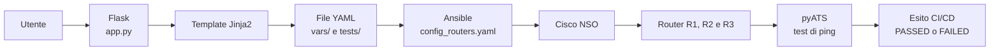

# Develop a NetDevOps System

Laboratorio didattico di network automation che realizza un ciclo NetDevOps
completo:

1. raccolta dell'intento tramite una piccola applicazione web Flask;
2. generazione dei dati YAML tramite template Jinja2;
3. configurazione della rete con Ansible e Cisco NSO;
4. verifica automatica della connettività con Cisco pyATS;
5. esecuzione sequenziale di configurazione e test tramite una pipeline CI/CD.

Il progetto deriva dal laboratorio Cisco **Develop a NetDevOps System** ed è
stato replicato da un'istanza GitLab locale nel repository GitHub
[`Demone54/network-automation-lab`](https://github.com/Demone54/network-automation-lab).

> [!WARNING]
> Questo repository applica configurazioni reali ai dispositivi registrati in
> Cisco NSO. Usarlo soltanto in un laboratorio isolato o su apparati per i quali
> si dispone di autorizzazione.

> [!IMPORTANT]
> Lo stato attuale riproduce volutamente lo scenario di errore finale del lab:
> `vars/R1.yaml` contiene `shutdown: null`, quindi l'esecuzione del playbook mette
> in shutdown `GigabitEthernet2` di R1. La pipeline può quindi fallire nella fase
> pyATS. Prima del primo avvio leggere la sezione
> [Controlli obbligatori](#controlli-obbligatori-prima-dellesecuzione).

## Obiettivo del repository

Il repository dimostra come trattare una modifica di rete come una modifica
software: i dati vengono versionati, la configurazione è applicata in modo
automatico e il risultato viene verificato da test ripetibili.



Il valore didattico non è il singolo ping, ma il **closed loop**:

```text
modifica dichiarativa -> configurazione -> verifica -> feedback
```

## Componenti

| Componente | Ruolo |
| --- | --- |
| Cisco NSO | Orchestrazione, CDB, modello di servizio e applicazione delle configurazioni |
| YANG | Definisce i dati accettati dal servizio `intfs` |
| Template XML NSO | Converte i dati del servizio in configurazione Cisco IOS |
| Flask | Espone il form web del laboratorio |
| Jinja2 | Genera i file YAML a partire dai dati inseriti nel form |
| Ansible | Invia a NSO l'istanza di servizio e lo stato dell'interfaccia di R1 |
| pyATS/AEtest | Si collega a R1, R2 e R3 ed esegue i test di raggiungibilità |
| GitLab CI | Esegue prima la configurazione e poi i test |
| GitHub | Rende il codice consultabile, clonabile e adatto a collaborazione/portfolio |

## Cosa è incluso

```text
.
├── .gitlab-ci.yml
├── ansible.cfg
├── app.py
├── config_routers.yaml
├── inventory.ini
├── group_vars/
│   └── all.yaml
├── nso-packages/
│   └── intfs/
│       ├── package-meta-data.xml
│       ├── load-dir/
│       ├── src/
│       │   └── yang/intfs.yang
│       ├── templates/
│       │   └── intfs-template.xml
│       └── test/
├── templates/
│   ├── R1_interface.j2
│   ├── service.html
│   ├── service.j2
│   └── targets.j2
├── tests/
│   ├── ping_targets.yaml
│   ├── pyats_job_runner.py
│   ├── pyats_pingtest.py
│   └── testbed.yaml
└── vars/
    ├── R1.yaml
    └── service_instance.yaml
```

### File principali

- `app.py`: riceve i valori del form e sovrascrive tre file:
  `vars/service_instance.yaml`, `tests/ping_targets.yaml` e `vars/R1.yaml`.
- `templates/service.j2`: genera i dati dell'istanza NSO `intfs`.
- `templates/targets.j2`: genera gli IP che pyATS deve raggiungere.
- `templates/R1_interface.j2`: genera lo stato amministrativo di
  `GigabitEthernet2` di R1.
- `config_routers.yaml`: playbook Ansible principale.
- `tests/testbed.yaml`: dispositivi, protocollo e credenziali usati da pyATS.
- `tests/pyats_pingtest.py`: test AEtest personalizzato per i ping.
- `.gitlab-ci.yml`: pipeline con stage `conf` e `test`.
- `nso-packages/intfs`: package NSO del servizio che crea una Loopback `/32`
  e la inserisce in OSPF processo 1, area 0.

> [!NOTE]
> `app.py` genera i file YAML, ma **non esegue** direttamente il playbook
> Ansible o pyATS. Questi passaggi devono essere avviati manualmente oppure da
> una pipeline.

## Cosa non è incluso

Per eseguire il progetto è necessario fornire separatamente:

- installazione e licenza Cisco NSO;
- NED Cisco IOS/IOS XE compatibile con i router;
- registrazione in NSO dei dispositivi denominati esattamente `R1`, `R2` e `R3`;
- immagini e topologia dei tre router;
- accesso di rete dal control node a NSO e ai router;
- un GitLab Runner, se si vuole usare la pipeline originale;
- una pipeline GitHub Actions, che al momento non è presente;
- gestione sicura delle credenziali per un ambiente diverso dal lab.

Il repository non crea quindi da solo la topologia Cisco del corso.

## Topologia originale del laboratorio

I file attuali fanno riferimento a questa rete privata:

| Sistema | Indirizzo/porta | Utilizzo |
| --- | --- | --- |
| Cisco NSO | `172.21.1.10:8083` | JSON-RPC usato da Ansible |
| R1 | `172.21.1.21` | Telnet usato da pyATS |
| R2 | `172.21.1.22` | Telnet usato da pyATS |
| R3 | `172.21.1.23` | Telnet usato da pyATS |
| Flask | `0.0.0.0:5000` | Form web |

Questi indirizzi sono validi soltanto nella rete del laboratorio originale.

## Prerequisiti

Ambiente di riferimento:

- Linux o una VM Linux con accesso alla topologia;
- Python 3.9.7, versione usata nel laboratorio;
- Cisco NSO 5.7 o successivo;
- NED Cisco IOS/IOS XE;
- Ansible e collection `cisco.nso`;
- Cisco pyATS/Genie e plugin Unicon per IOS XE;
- Flask, Jinja2 e PyYAML;
- Git;
- GitLab e GitLab Runner soltanto per la pipeline originale.

Versioni diverse possono funzionare, ma devono essere verificate. Il package
`intfs` dichiara NSO 5.7 come versione minima.

## Installazione delle dipendenze Python

Clonare il progetto:

```bash
git clone https://github.com/Demone54/network-automation-lab.git
cd network-automation-lab
```

Creare un ambiente virtuale:

```bash
python3.9 -m venv .venv
source .venv/bin/activate
python -m pip install --upgrade pip
```

Installare le dipendenze:

```bash
python -m pip install ansible Flask Jinja2 PyYAML "pyats[full]"
ansible-galaxy collection install cisco.nso
```

La collection `cisco.nso` non è più inclusa automaticamente nelle versioni
recenti del pacchetto Ansible e deve essere installata esplicitamente.

Verificare:

```bash
python --version
ansible --version
pyats version check
ansible-galaxy collection list | grep cisco.nso
```

Se Ansible non riconosce il nome breve `nso_config`, usare il Fully Qualified
Collection Name nel playbook:

```yaml
cisco.nso.nso_config:
```

al posto di:

```yaml
nso_config:
```

## Installazione del package NSO `intfs`

Il package contiene:

- `intfs.yang`: modello del servizio;
- `intfs-template.xml`: template di configurazione;
- `src/Makefile`: compilazione del modello YANG;
- `load-dir/intfs.fxs`: artefatto compilato presente nel lab.

Il file `.fxs` incluso potrebbe non essere compatibile con una versione diversa
di NSO. È preferibile ricompilarlo nell'ambiente di destinazione.

Esempio per un'istanza NSO locale:

```bash
export NCS_RUN_DIR="$HOME/nso-instance"
cp -R nso-packages/intfs "$NCS_RUN_DIR/packages/"
make -C "$NCS_RUN_DIR/packages/intfs/src" clean all
cd "$NCS_RUN_DIR"
ncs --with-package-reload
ncs --status
```

Se NSO è già in esecuzione, aprire la CLI e ricaricare i package con il comando
previsto dalla propria versione:

```bash
ncs_cli -C -u admin
```

```text
packages reload
```

Il servizio `intfs` richiede che `R1`, `R2` e `R3` siano già presenti nel CDB,
perché il campo `device` nel modello YANG è un `leafref` verso i dispositivi
registrati in NSO.

## Configurazione dell'ambiente

Adattare almeno questi file prima dell'esecuzione:

| File | Dato da modificare |
| --- | --- |
| `inventory.ini` | indirizzo e porta del server NSO |
| `config_routers.yaml` | URL JSON-RPC di NSO, presente in due task |
| `group_vars/all.yaml` | credenziali NSO e parametri HTTP API |
| `tests/testbed.yaml` | IP, protocollo e credenziali dei router |
| `vars/service_instance.yaml` | servizio, device, Loopback e IP da creare |
| `vars/R1.yaml` | stato di `GigabitEthernet2` di R1 |
| `tests/ping_targets.yaml` | IP da verificare da ciascun router |

Le chiavi di `vars/service_instance.yaml` devono corrispondere al modello YANG:

```yaml
tailf-ncs:services:
  intfs:intfs:
    - name: srv-demo
      device: R2
      intf_number: 100
      ip_add: <IP_LOOPBACK_LIBERO>
```

L'indirizzo in `tests/ping_targets.yaml` deve essere lo stesso creato dal
servizio, altrimenti il test di raggiungibilità fallirà.

## Controlli obbligatori prima dell'esecuzione

### 1. Stato di R1

Nel modello usato dal lab:

```yaml
shutdown:
  - null
```

equivale al comando IOS:

```text
interface GigabitEthernet2
 shutdown
```

mentre:

```yaml
shutdown:
  - no
```

equivale a:

```text
interface GigabitEthernet2
 no shutdown
```

Per una prima esecuzione non distruttiva, verificare che R1 non venga isolato
involontariamente.

### 2. Credenziali

`group_vars/all.yaml` e `tests/testbed.yaml` contengono credenziali dimostrative
in chiaro. Sostituirle prima di usare una rete diversa dal laboratorio.

### 3. Indirizzi IP

Verificare che:

- l'IP della nuova Loopback non sia già utilizzato;
- la Loopback sia annunciata da OSPF;
- il control node raggiunga NSO e tutti e tre i router;
- l'IP in `ping_targets.yaml` corrisponda alla Loopback creata.

### 4. Direzione della sincronizzazione NSO

Nel laboratorio preconfigurato viene usato `sync-to`, che invia ai router la
configurazione presente nel CDB. In un ambiente appena creato potrebbe invece
essere necessario `sync-from`, che importa in NSO la configurazione dei router.

Non eseguire `sync-to` senza aver verificato il diff, perché può sovrascrivere
la configurazione dei dispositivi.

## Esecuzione del laboratorio

### 1. Avviare e verificare NSO

```bash
cd "$HOME/nso-instance"
ncs
ncs --status
ncs_cli -C -u admin
```

Se `ncs --status` restituisce `connection refused`, il processo NSO locale non è
avviato oppure il comando viene eseguito dalla directory errata.

Nel lab preconfigurato, la sincronizzazione mostrata dal corso è:

```text
devices device R1 sync-to
devices device R2 sync-to
devices device R3 sync-to
```

### 2. Creare manualmente un servizio NSO

Esempio equivalente al primo esercizio:

```text
config
services intfs srv1 device R1 intf_number 10 ip_add 10.1.1.1
top
commit
```

Il template genera indicativamente:

```text
interface Loopback10
 ip address 10.1.1.1 255.255.255.255
 ip ospf 1 area 0
```

Per eliminare l'istanza:

```text
config
no services intfs srv1
commit
```

### 3. Usare il portale Flask

Avviare l'applicazione dalla radice del repository:

```bash
python app.py
```

Aprire:

```text
http://127.0.0.1:5000
```

oppure l'indirizzo della VM sulla porta `5000`.

Il form richiede:

- nome dell'istanza;
- device `R1`, `R2` o `R3`;
- numero della Loopback;
- indirizzo IP;
- eventuale shutdown di `GigabitEthernet2` su R1.

Dopo aver premuto **Connect**, controllare le modifiche:

```bash
git diff -- vars/service_instance.yaml tests/ping_targets.yaml vars/R1.yaml
```

> [!CAUTION]
> L'applicazione usa il server di sviluppo Flask con `debug=True` e ascolta su
> `0.0.0.0`. Non esporla su Internet e non usarla in produzione.

### 4. Verificare ed eseguire il playbook

Controllare prima sintassi e file interessati:

```bash
ansible-playbook --syntax-check config_routers.yaml
git diff -- config_routers.yaml group_vars/all.yaml vars/
```

Eseguire:

```bash
ansible-playbook config_routers.yaml
```

Il playbook:

1. carica `vars/service_instance.yaml` nella variabile `serv`;
2. carica `vars/R1.yaml` nella variabile `R1_intf`;
3. crea o aggiorna l'istanza `intfs` tramite NSO;
4. applica a R1 lo stato di `GigabitEthernet2`.

### 5. Eseguire i test pyATS

Validare il testbed:

```bash
pyats validate testbed tests/testbed.yaml
```

Eseguire il job:

```bash
cd tests
pyats run job pyats_job_runner.py \
  --testbed testbed.yaml \
  --targets ping_targets.yaml
cd ..
```

Il test:

1. carica `testbed.yaml`;
2. si collega a R1, R2 e R3;
3. legge per ogni router gli IP presenti in `ping_targets.yaml`;
4. esegue i ping;
5. interpreta l'output IOS;
6. disconnette i dispositivi;
7. restituisce un esito a pyATS e alla pipeline.

Il test è personalizzato per output Cisco IOS contenente una riga simile a:

```text
Success rate is 100 percent
```

### 6. Verifica manuale sui router

Comandi utili:

```text
show ip interface brief
show ip route ospf
show ip ospf neighbor
ping <IP_LOOPBACK>
```

Verificare che:

- la Loopback esista sul router scelto;
- l'indirizzo sia corretto;
- OSPF annunci la rotta agli altri router;
- `GigabitEthernet2` di R1 sia nello stato previsto;
- tutti i ping attesi abbiano successo.

## Percorso didattico consigliato

1. Esplorare il CDB e il servizio `intfs` in NSO.
2. Creare e rimuovere una Loopback dalla CLI NSO.
3. Creare un'istanza `intfs` con Ansible.
4. Spostare i dati del servizio in `vars/service_instance.yaml`.
5. Eseguire pyATS con un IP inesistente e osservare il fallimento.
6. Creare la Loopback corrispondente e osservare il test superato.
7. Portare `GigabitEthernet2` di R1 in shutdown e osservare la perdita di
   adiacenza/connettività.
8. Ripristinare `no shutdown` e verificare il recupero.
9. Generare i tre file YAML con Flask e Jinja2.
10. Versionare le modifiche ed eseguire configurazione e test in CI/CD.

## Pipeline CI/CD

Il file `.gitlab-ci.yml` contiene due stage:

```text
conf -> test
```

- `topology_conf` esegue `ansible-playbook config_routers.yaml`;
- `test_connect` entra nella cartella `tests` ed esegue il job pyATS.

Un fallimento nello stage `conf` impedisce normalmente l'avvio del test. Un
fallimento nello stage `test` indica che la configurazione è stata applicata,
ma la connettività attesa non è stata verificata.

### GitLab

Per usare la pipeline originale è necessario un GitLab Runner che:

- abbia Ansible, la collection `cisco.nso` e pyATS installati;
- possa raggiungere la rete privata del laboratorio;
- disponga delle credenziali tramite variabili CI/CD protette;
- sia autorizzato ad applicare configurazioni ai dispositivi.

### GitHub

La presenza di `.gitlab-ci.yml` in GitHub **non avvia GitHub Actions**.
GitHub riconosce i workflow soltanto sotto `.github/workflows/`.

Per migrare la pipeline su GitHub Actions è consigliato un runner self-hosted
all'interno del laboratorio. Un runner GitHub pubblico non può raggiungere
direttamente gli indirizzi privati `172.21.1.0/24` e non deve contenere
credenziali hardcoded.

## Sicurezza

Prima di condividere o riutilizzare il progetto:

- rimuovere password, token e indirizzi sensibili dalla cronologia Git;
- usare Ansible Vault, un secret manager o i secret della piattaforma CI;
- sostituire Telnet con SSH quando l'ambiente lo permette;
- disattivare il debug Flask;
- limitare l'ascolto web a un'interfaccia affidabile;
- proteggere e isolare i runner CI;
- eseguire backup e diff NSO prima delle modifiche;
- non usare `sync-to` alla cieca;
- non pubblicare package, immagini o materiali per i quali non si possiedono i
  diritti di redistribuzione.

Le credenziali `admin/admin`, `cisco/cisco` e `root/cisco123` visibili nel
materiale originale sono valori dimostrativi del laboratorio e non devono
essere riutilizzati.

## Risoluzione dei problemi

### `ncs --status` restituisce `connection refused`

Entrare nella directory dell'istanza NSO e avviare `ncs`:

```bash
cd "$HOME/nso-instance"
ncs
ncs --status
```

### Il servizio `intfs` non compare

Controllare compilazione, percorso del package e reload:

```bash
make -C "$NCS_RUN_DIR/packages/intfs/src" clean all
ncs_cli -C -u admin
```

Quindi eseguire `packages reload` o il comando equivalente della versione NSO
installata.

### Ansible non trova `nso_config`

```bash
ansible-galaxy collection install cisco.nso
```

Usare quindi `cisco.nso.nso_config` nel playbook.

### Ansible non raggiunge NSO

Verificare:

- URL `http://<NSO>:<PORTA>/jsonrpc`;
- porta HTTP API configurata in `ncs.conf`;
- credenziali;
- firewall e routing;
- coerenza tra `inventory.ini`, `group_vars/all.yaml` e
  `config_routers.yaml`.

### pyATS non si collega ai router

Verificare `tests/testbed.yaml`, protocollo, IP, credenziali e raggiungibilità:

```bash
pyats validate testbed tests/testbed.yaml
```

### La pipeline fallisce nel test di ping

Controllare prima:

- `vars/R1.yaml`: `shutdown: null` può isolare R1;
- `tests/ping_targets.yaml`: gli IP devono coincidere con quelli creati;
- stato OSPF e route;
- presenza della Loopback sul router;
- output dettagliato del job `test_connect`.

Nel commit finale del laboratorio il fallimento è intenzionale.

## Contribuire

1. Creare un fork del repository.
2. Creare un branch descrittivo.
3. Non inserire credenziali reali.
4. Verificare YAML, playbook e test.
5. Aprire una pull request spiegando ambiente, topologia e risultati.

Miglioramenti utili:

- aggiungere `requirements.txt` o `pyproject.toml`;
- aggiungere `.gitignore` per `__pycache__`, ambienti virtuali e log pyATS;
- spostare credenziali e indirizzi in variabili sicure;
- usare il FQCN `cisco.nso.nso_config`;
- aggiungere validazione del form Flask;
- aggiungere test unitari;
- creare un workflow GitHub Actions per controlli statici;
- usare un runner self-hosted soltanto per i test che richiedono il lab.

## Licenza e attribuzione

Questo repository non contiene attualmente un file `LICENSE`. Un repository
pubblico è consultabile, ma non diventa automaticamente open source.

Il progetto è pubblicato a scopo didattico e fa riferimento a tecnologie e
materiali Cisco. Cisco, Cisco NSO, IOS XE, pyATS e i relativi marchi
appartengono ai rispettivi titolari. Prima di aggiungere una licenza o
redistribuire materiale derivato dal corso, verificare di possederne i diritti.

## Documentazione ufficiale

- [Cisco NSO CLI](https://developer.cisco.com/docs/nso/guides/nso-cli/)
- [Cisco NSO package development](https://developer.cisco.com/docs/nso/guides/package-development/)
- [Cisco pyATS](https://developer.cisco.com/docs/pyats/)
- [Collection Ansible `cisco.nso`](https://galaxy.ansible.com/ui/repo/published/cisco/nso/docs/)
- [GitLab CI/CD YAML](https://docs.gitlab.com/ci/yaml/)
- [GitLab Runner](https://docs.gitlab.com/runner/)
- [Sintassi GitHub Actions](https://docs.github.com/en/actions/reference/workflows-and-actions/workflow-syntax)
